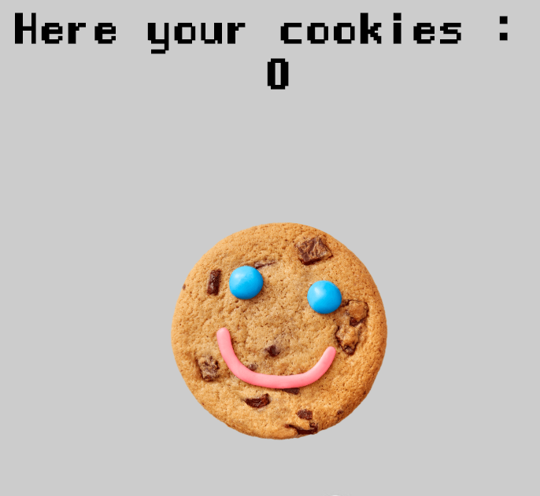
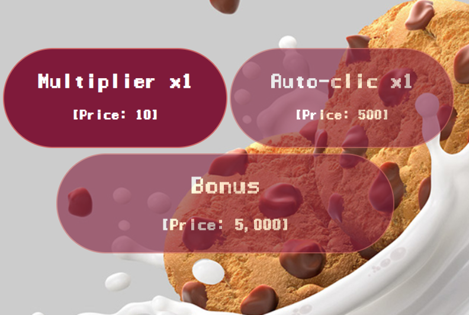

Cookies Clicker
=================================

Group project of [Broutin Jean-Marc](https://github.com/jmbroutin), [Diambu Antoine](https://github.com/AntoineDia), [Ismail Joseph](https://github.com/Fesouille) and [Wauquier Teddy](https://github.com/Elleonors).
----------------------------------

*Exercice realized from the 07 february 2019 to 14 february 2019, as a group project for the formation [BeCode](https://www.becode.org/) to be a Web Developper*

* Project:
For this project, we have to realize a game based on the famous [Cookie Clicker](http://orteil.dashnet.org/cookieclicker/). As our first game, we don't have to make it 100% similar, but we have a list of given functionalities to create (such as 'the multiplier', 'the autoclicker', 'the bonus'). 
In order to achieve this project in group, we made use of [Trello](https://trello.com/b/qQLJ6aG3) as our Kanban tool.

* Content:
	* HTML file: contains the head, body, and links to javascript and css files.

	* CSS file: handles the style of the different functionalities and the body.

	* Javascript file: this file contains all functionalities of the game i.e. the button, their actions, ...

	* Kanban tool: [Trello](https://trello.com/b/qQLJ6aG3)

* Try the game! :
	* [Our first cookie clicker](https://fesouille.github.io/Cookies-clicker/)

* A few illustrating pictures:

* Progress: 
	* 07 february 2019: project beginning. In order to achieve this project in group, we made use of [Trello](https://trello.com/b/qQLJ6aG3) as our Kanban tool.
	* 14 janvier 2019: project end
